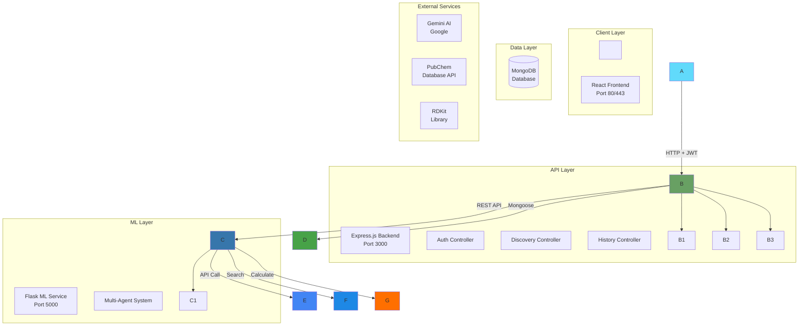
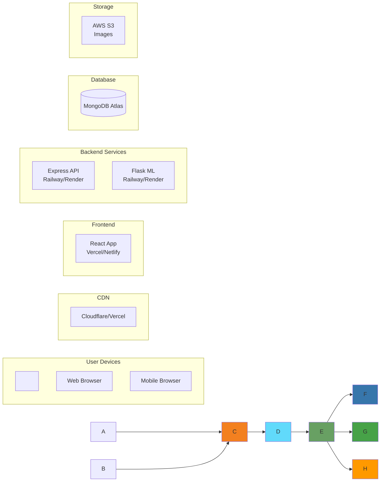

\# System Architecture

\## High-Level Architecture



\## Discovery Flow

```mermaid

sequenceDiagram

&nbsp;   participant U as User

&nbsp;   participant F as Frontend

&nbsp;   participant B as Backend

&nbsp;   participant ML as ML Service

&nbsp;   participant G as Gemini AI

&nbsp;   participant P as PubChem

&nbsp;   participant R as RDKit

&nbsp;   participant DB as MongoDB

&nbsp;

&nbsp;   U->>F: Submit criteria

&nbsp;   F->>B: POST /api/discover + JWT

&nbsp;   B->>B: Verify JWT

&nbsp;   B->>ML: POST /api/discover

&nbsp;

&nbsp;   ML->>ML: Preprocess input

&nbsp;   ML->>P: Search base compounds

&nbsp;   P-->>ML: Compound data

&nbsp;

&nbsp;   ML->>G: Generate novel compounds

&nbsp;   G-->>ML: 3 compounds (JSON)

&nbsp;

&nbsp;   ML->>R: Calculate properties

&nbsp;   R-->>ML: MW, LogP, etc.

&nbsp;

&nbsp;   ML->>R: Generate images

&nbsp;   R-->>ML: Base64 images

&nbsp;

&nbsp;   ML-->>B: Discovery result

&nbsp;

&nbsp;   B->>B: Convert base64 to PNG

&nbsp;   B->>B: Save images to disk

&nbsp;   B->>DB: Save discovery

&nbsp;   DB-->>B: Saved document

&nbsp;

&nbsp;   B-->>F: Discovery + image paths

&nbsp;   F-->>U: Display results

```

\## Data Model

```mermaid

erDiagram

&nbsp;   USER ||--o{ DISCOVERY : creates

&nbsp;   USER ||--o{ FAVORITE : saves

&nbsp;

&nbsp;   USER {

&nbsp;       ObjectId \_id

&nbsp;       string email

&nbsp;       string password

&nbsp;       string name

&nbsp;       date lastLogin

&nbsp;       date createdAt

&nbsp;   }

&nbsp;

&nbsp;   DISCOVERY {

&nbsp;       ObjectId \_id

&nbsp;       ObjectId userId

&nbsp;       string criteria

&nbsp;       object preprocessingAnalysis

&nbsp;       string analysis

&nbsp;       array compounds

&nbsp;       object validation

&nbsp;       string justification

&nbsp;       date createdAt

&nbsp;   }

&nbsp;

&nbsp;   FAVORITE {

&nbsp;       ObjectId \_id

&nbsp;       ObjectId userId

&nbsp;       object compoundData

&nbsp;       array tags

&nbsp;       string notes

&nbsp;       date createdAt

&nbsp;   }

```

\## Deployment Architecture (Future)


