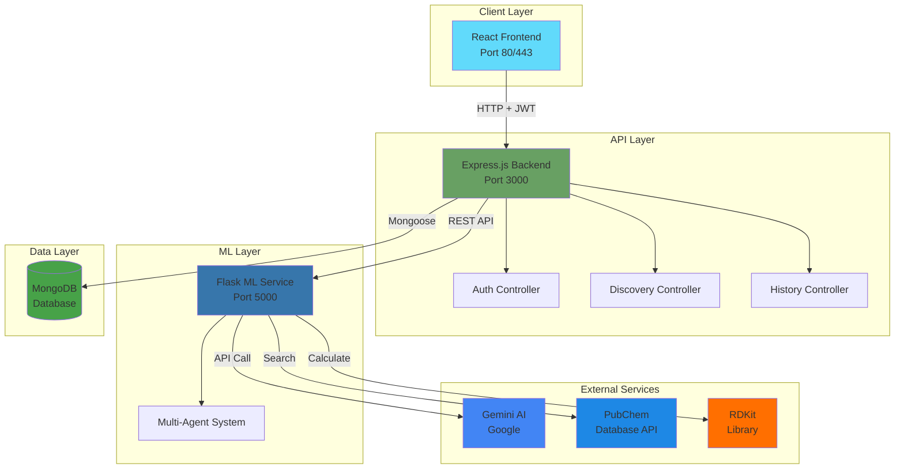
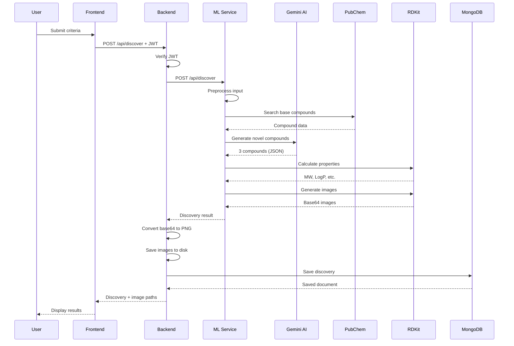
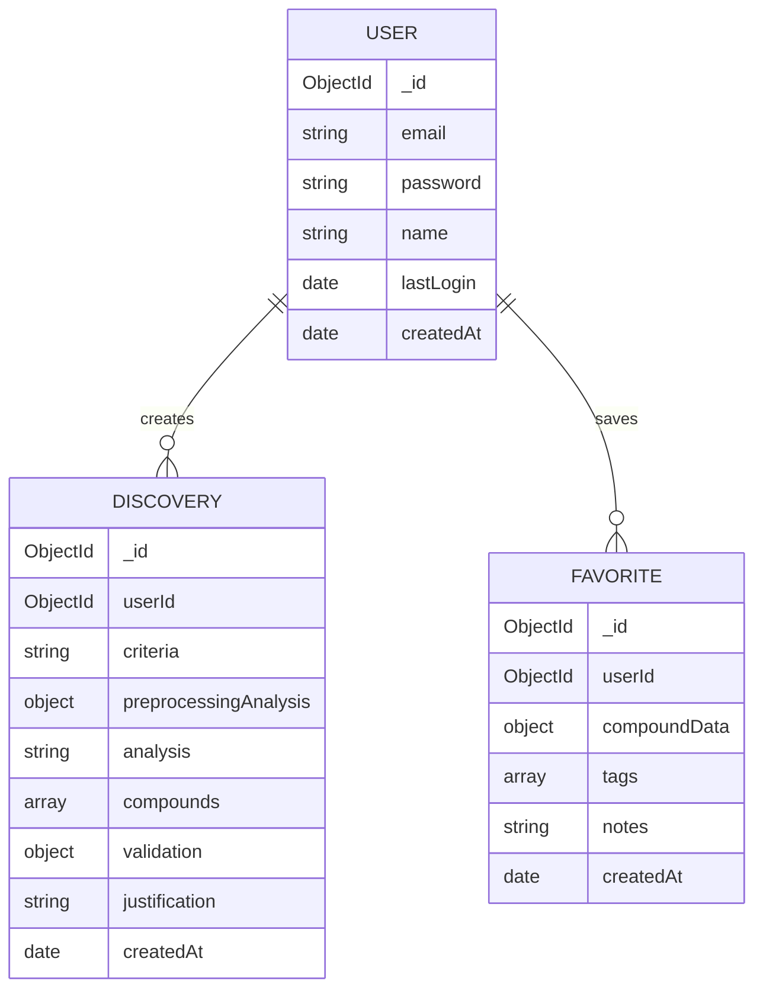
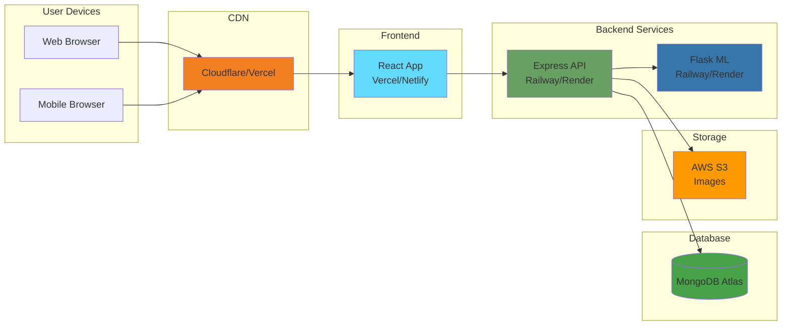

# System Architecture

## High-Level Architecture

```mermaid
graph TB
    subgraph "Client Layer"
        A[React Frontend<br/>Port 80/443]
    end

    subgraph "API Layer"
        B[Express.js Backend<br/>Port 3000]
        B1[Auth Controller]
        B2[Discovery Controller]
        B3[History Controller]
        B --> B1
        B --> B2
        B --> B3
    end

    subgraph "ML Layer"
        C[Flask ML Service<br/>Port 5000]
        C1[Multi-Agent System]
        C --> C1
    end

    subgraph "Data Layer"
        D[(MongoDB<br/>Database)]
    end

    subgraph "External Services"
        E[Gemini AI<br/>Google]
        F[PubChem<br/>Database API]
        G[RDKit<br/>Library]
    end

    A -->|HTTP + JWT| B
    B -->|Mongoose| D
    B -->|REST API| C
    C -->|API Call| E
    C -->|Search| F
    C -->|Calculate| G

    style A fill:#61dafb
    style B fill:#68a063
    style C fill:#3776ab
    style D fill:#47a248
    style E fill:#4285f4
    style F fill:#1e88e5
    style G fill:#ff6f00
```

## Discovery Flow

```mermaid
sequenceDiagram
    participant U as User
    participant F as Frontend
    participant B as Backend
    participant ML as ML Service
    participant G as Gemini AI
    participant P as PubChem
    participant R as RDKit
    participant DB as MongoDB

    U->>F: Submit criteria
    F->>B: POST /api/discover + JWT
    B->>B: Verify JWT
    B->>ML: POST /api/discover

    ML->>ML: Preprocess input
    ML->>P: Search base compounds
    P-->>ML: Compound data

    ML->>G: Generate novel compounds
    G-->>ML: 3 compounds (JSON)

    ML->>R: Calculate properties
    R-->>ML: MW, LogP, etc.

    ML->>R: Generate images
    R-->>ML: Base64 images

    ML-->>B: Discovery result

    B->>B: Convert base64 to PNG
    B->>B: Save images to disk
    B->>DB: Save discovery
    DB-->>B: Saved document

    B-->>F: Discovery + image paths
    F-->>U: Display results
```

## Data Model

```mermaid
erDiagram
    USER ||--o{ DISCOVERY : creates
    USER ||--o{ FAVORITE : saves

    USER {
        ObjectId _id
        string email
        string password
        string name
        date lastLogin
        date createdAt
    }

    DISCOVERY {
        ObjectId _id
        ObjectId userId
        string criteria
        object preprocessingAnalysis
        string analysis
        array compounds
        object validation
        string justification
        date createdAt
    }

    FAVORITE {
        ObjectId _id
        ObjectId userId
        object compoundData
        array tags
        string notes
        date createdAt
    }
```

## Deployment Architecture (Future)

```mermaid
graph LR
    subgraph "User Devices"
        A[Web Browser]
        B[Mobile Browser]
    end

    subgraph "CDN"
        C[Cloudflare/Vercel]
    end

    subgraph "Frontend"
        D[React App<br/>Vercel/Netlify]
    end

    subgraph "Backend Services"
        E[Express API<br/>Railway/Render]
        F[Flask ML<br/>Railway/Render]
    end

    subgraph "Database"
        G[(MongoDB Atlas)]
    end

    subgraph "Storage"
        H[AWS S3<br/>Images]
    end

    A --> C
    B --> C
    C --> D
    D --> E
    E --> F
    E --> G
    E --> H

    style C fill:#f38020
    style D fill:#61dafb
    style E fill:#68a063
    style F fill:#3776ab
    style G fill:#47a248
    style H fill:#ff9900
```
